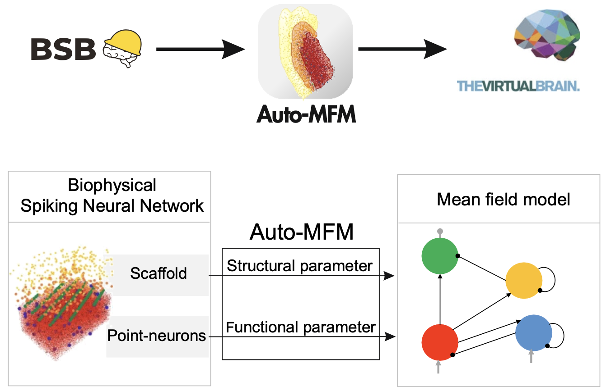

# Auto-MFM

**Auto-MFM** is a novel computational framework for automated multiscale modeling of brain circuits, designed to streamline the generation of mesoscale models (i.e., Mean Field Models, MFMs) from their biophysically-based microcircuit counterparts (i.e., Spiking Neural Networks, SNNs). Auto-MFM leverages two fundamental assets:

1. **MFM construction from biophysical SNNs** — achieved through a fully automated translation of parameters from the micro- to the mesoscopic domain.
2. **Transformation of a MFM into pathological variants** — enabling systematic exploration of disease-related dynamics directly at the mean-field level.

Auto-MFM is designed to be part of the multi-scale modeling ecosystem together with the BSB (https://www.ebrains.eu/tools/bsb) for biophysical SNN construction and TVB (https://ebrains.eu/data-tools-services/tools/the-virtual-brain) for whole-brain dynamics simulations.

## Cerebellar test-bench
This repository contains the implementation of the **Cerebellar Mean Field model**. The model is developed based on the methods presented in **Lorenzi et al., 2023, Plos Comp Bio** and updated to reproduce the cerebellar dynamics tuned on awake states.

---

## Citation

If you use the Aut-MFM, please cite:

> **Automated derivation of mean field models from spiking neural networks for the simulation of brain dynamics**
> Roberta M. Lorenzi, Marialaura De Grazia, Claudia A.M. Gandini Wheeler Kingshott, Fulvia Palesi, Egidio D'Angelo, Claudia Casellato
> *bioRxiv* 2026.03.18.712631; doi: [https://doi.org/10.64898/2026.03.18.712631](https://doi.org/10.64898/2026.03.18.712631)

---

## Model Overview

The cerebellar network comprises the following cell types, each modelled as an **E-GLIF point neuron**:

- **GrC** — Granule Cell
- **GoC** — Golgi Cell
- **MLI** — Molecular Layer Interneuron
- **PC** — Purkinje Cell

---

## Single-Cell Parameters

The table below reports the intrinsic parameters of the E-GLIF neuron model for each cell type. All conductances are in nS, capacitances in pF, times in ms, potentials in mV, and currents in pA.

| Parameter | Description | GrC | GoC | MLI | PC |
|-----------|-------------|-----|-----|-----|----|
| `Gl` | Leak conductance (nS) | 0.2899 | 3.2955 | 1.6 | 7.1064 |
| `Cm` | Membrane capacitance (pF) | 7.0 | 145.0 | 14.6 | 334.0 |
| `Trefrac` | Refractory period (ms) | 1.5 | 2.0 | 1.59 | 0.5 |
| `tm` | Membrane time constant (ms) | 24.15 | 44.0 | 9.125 | 47.0 |
| `El` | Leak reversal potential (mV) | −62.0 | −62.0 | −68.0 | −59.0 |
| `Vthre` | Spike threshold (mV) | −41.0 | −55.0 | −53.0 | −43.0 |
| `Vreset` | Reset potential (mV) | −70.0 | −75.0 | −78.0 | −69.0 |
| `delta_v` | Threshold variability (mV) | 0.3 | 0.4 | 1.1 | 3.5 |
| `kadap` | Adaptation conductance (nS/mV) | 0.022 | 0.217 | 2.025 | 1.491 |
| `k2` | Subthreshold adaptation rate | 0.041 | 0.023 | 1.096 | 0.041 |
| `k1` | Spike-triggered adaptation rate | 0.311 | 0.031 | 1.887 | 0.195 |
| `A2` | Adaptation increment 2 | −0.94 | 178.01 | 5.863 | 172.622 |
| `A1` | Adaptation increment 1 | 0.01 | 259.988 | 5.953 | 157.622 |
| `Ie` | External bias current (pA) | −0.888 | 16.214 | 3.711 | 780.0 |

---

## Synaptic Connectivity Parameters

The tables below report the synaptic parameters for each pre→post connection. Parameters: `K` = number of synaptic contacts, `Q` = quantal conductance (nS), `Tsyn` = synaptic decay time constant (ms), `Erev` = reversal potential (mV). Connections with all parameters set to 0 are absent in the network.

### Connections TO GrC

| Pre → Post | K | Q (nS) | Tsyn (ms) | Erev (mV) |
|------------|------|--------|-----------|-----------|
| MF → GrC | 2.024 | 0.23 | 5.8 | 0.0 |
| GrC → GrC | 0.0 | 0.0 | 0.0 | 0.0 |
| GoC → GrC | 1.77 | 0.36 | 13.61 | −80.0 |
| MLI → GrC | 0.0 | 0.0 | 0.0 | 0.0 |
| PC → GrC | 0.0 | 0.0 | 0.0 | 0.0 |

### Connections TO GoC

| Pre → Post | K | Q (nS) | Tsyn (ms) | Erev (mV) |
|------------|--------|--------|-----------|-----------|
| MF → GoC | 38.5 | 0.24 | 0.23 | 0.0 |
| GrC → GoC | 590.03 | 0.44 | 0.875 | 0.0 |
| GoC → GoC | 28.0 | 1.12 | 10.0 | −80.0 |
| MLI → GoC | 0.0 | 0.0 | 0.0 | 0.0 |
| PC → GoC | 0.0 | 0.0 | 0.0 | 0.0 |

### Connections TO MLI

| Pre → Post | K | Q (nS) | Tsyn (ms) | Erev (mV) |
|------------|--------|-------|-----------|-----------|
| MF → MLI | 0.0 | 0.0 | 0.0 | 0.0 |
| GrC → MLI | 260.24 | 0.07 | 0.64 | 0.0 |
| GoC → MLI | 0.0 | 0.0 | 0.0 | 0.0 |
| MLI → MLI | 6.71 | 0.547 | 2.00 | −80.0 |
| PC → MLI | 0.0 | 0.0 | 0.0 | 0.0 |

### Connections TO PC

| Pre → Post | K | Q (nS) | Tsyn (ms) | Erev (mV) |
|------------|--------|-------|-----------|-----------|
| MF → PC | 0.0 | 0.0 | 0.0 | 0.0 |
| GrC → PC | 579.32 | 0.275 | 1.10 | 0.0 |
| GoC → PC | 0.0 | 0.0 | 0.0 | 0.0 |
| MLI → PC | 4.07 | 1.22 | 2.80 | −80.0 |
| PC → PC | 0.0 | 0.0 | 0.0 | 0.0 |

---

## References
- **Auto-MFM**: Lorenzi R.M., De Grazia M., Gandini Wheeler Kingshott C.A.M., Palesi F., D'Angelo E., Casellato C. (2026). *Automated derivation of mean field models from spiking neural networks for the simulation of brain dynamics*. **bioRxiv** 2026.03.18.712631. doi: [10.64898/2026.03.18.712631](https://doi.org/10.64898/2026.03.18.712631)
- **Cerebellar SPiking Neural Network**: Geminiani A, Pedrocchi A, D’Angelo E and Casellato C (2019) Response Dynamics in an Olivocerebellar Spiking Neural Network With Non-linear Neuron Properties. Front. Comput. Neurosci. 13:68. doi: 10.3389/fncom.2019.00068
- **Cerebellar Mean Field Model**: Lorenzi RM, Geminiani A, Zerlaut Y, De Grazia M, Destexhe A, Gandini Wheeler-Kingshott CAM, Palesi F, Casellato C, D'Angelo E. A multi-layer mean-field model of the cerebellum embedding microstructure and population-specific dynamics. **PLoS Comput Biol.** 2023 Sep 1;19(9):e1011434. doi: 10.1371/journal.pcbi.1011434
- **Transfer Function Fitting**: Zerlaut Y., Chemla S., Chavane F., Destexhe A. (2018). *Modeling mesoscopic cortical dynamics using a mean-field model of conductance-based networks of adaptive exponential integrate-and-fire neurons*. **Journal of Computational Neuroscience**, 44(1), 45–61.

---

## Contact

For any inquiries, please contact Roberta M. Lorenzi at robertamaria.lorenzi01@universitadipavia.it.
